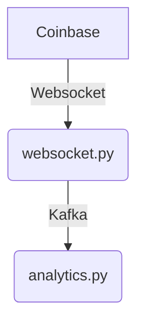

# Current London 2026 Example

Python data streaming example used to illustrate a talk at Current London 2026 conference.

## Architecture Overview

We will connect to Coinbase's websocket API to receive crypto market updates in real time.
In order to share this data with other services and decouple producers from consumers, we'll publish this data over [Kafka](https://kafka.apache.org/), as json.

We'll then run a python application job that will read the data from Kafka and run some analytics workload on it


  
## Initial Set Up

You'll need:

- Git
- Python (at least 3.10)
- Docker to run a Kafka cluster

The code for this tutorial is available on [github](https://github.com/0x26res/current-london-2026)

### Clone the repo

```shell
git https://github.com/0x26res/current-london-2026
```

### Set Up the Virtual Environment

```shell
uv sync
```

### Set Up Kafka

We use the [kafka-kraft](https://github.com/bashj79/kafka-kraft-docker) docker image to run a super simple Kafka cluster.
To start the cluster the first time:

```shell
docker run --name=simple_kafka -p 9092:9092 -d bashj79/kafka-kraft
```

And the second time:

```shell
docker start simple_kafka
```

Once started you can create a Kafka topics called `price` and `status`.

```shell
docker exec simple_kafka /opt/kafka/bin/kafka-topics.sh --bootstrap-server=localhost:9092 --create --topic=price --partitions=1 --replication-factor=1
docker exec simple_kafka /opt/kafka/bin/kafka-topics.sh --bootstrap-server=localhost:9092 --create --topic=status --partitions=1 --replication-factor=1
```

### Publish Coinbase's Market Data on Kafka

In this step, we'll run a simple python job that listen to Coinbase's Websocket market data API, and publish the data on the `price` Kafka topic.

```shell
uv run python ./websocket_feed.py
```

You should now be able to see the Coinbase data streaming on Kafka.

```shell
docker exec simple_kafka /opt/kafka/bin/kafka-console-consumer.sh --bootstrap-server=localhost:9092 --topic=price
docker exec simple_kafka /opt/kafka/bin/kafka-console-consumer.sh --bootstrap-server=localhost:9092 --topic=status
```

Prices look like this:

```json lines
{"sequence": 126772717215, "product_id": "BTC-USD", "price": "75205.32", "open_24h": "76064.94", "volume_24h": "6971.01295932", "low_24h": "73741.53", "high_24h": "76193.12", "volume_30d": "257056.93796654", "best_bid": "75203.18", "best_bid_size": "0.21317581", "best_ask": "75205.32", "best_ask_size": "0.24736366", "side": "buy", "time": "2026-04-20T14:04:11.141674Z", "trade_id": 1005003868, "last_size": "0.01857498"}
{"sequence": 96776691025, "product_id": "ETH-USD", "price": "2306.4", "open_24h": "2339.29", "volume_24h": "113767.11338547", "low_24h": "2252.06", "high_24h": "2342.69", "volume_30d": "4253609.46477611", "best_bid": "2306.39", "best_bid_size": "1.09341702", "best_ask": "2306.60", "best_ask_size": "0.00100000", "side": "buy", "time": "2026-04-20T14:04:11.309896Z", "trade_id": 800001428, "last_size": "0.81750835"}
```

And status:

```json lines
{"id": "BTC-USD", "base_currency": "BTC", "quote_currency": "USD", "base_increment": "0.00000001", "quote_increment": "0.01", "display_name": "BTC-USD", "status": "online", "margin_enabled": false, "status_message": "", "min_market_funds": "1", "post_only": false, "limit_only": false, "cancel_only": false, "auction_mode": false, "type": "spot", "fx_stablecoin": false, "max_slippage_percentage": "0.02000000"}
{"id": "CBETH-USD", "base_currency": "CBETH", "quote_currency": "USD", "base_increment": "0.00001", "quote_increment": "0.01", "display_name": "cbETH-USD", "status": "online", "margin_enabled": false, "status_message": "", "min_market_funds": "1", "post_only": false, "limit_only": false, "cancel_only": false, "auction_mode": false, "type": "spot", "fx_stablecoin": false, "max_slippage_percentage": "0.03000000"}
```

### Run the dashboard

```shell
uv run python ./analytics.py
```
